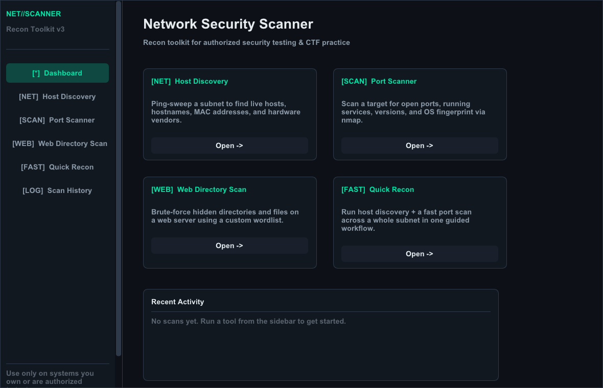
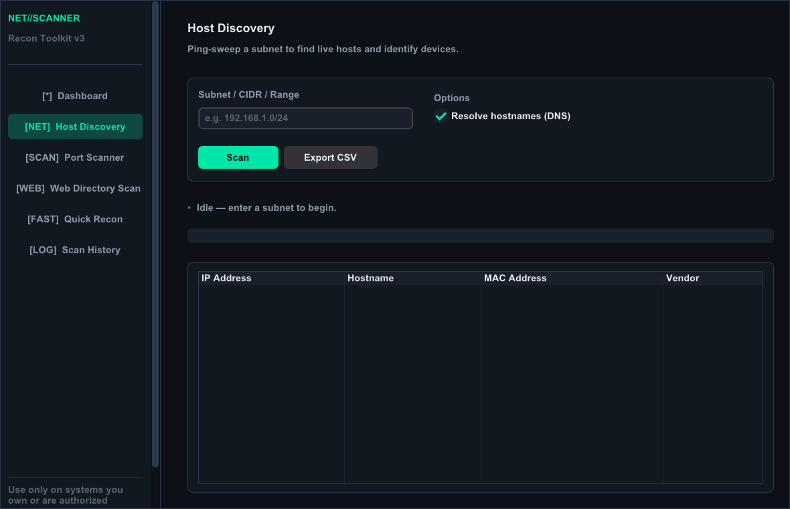
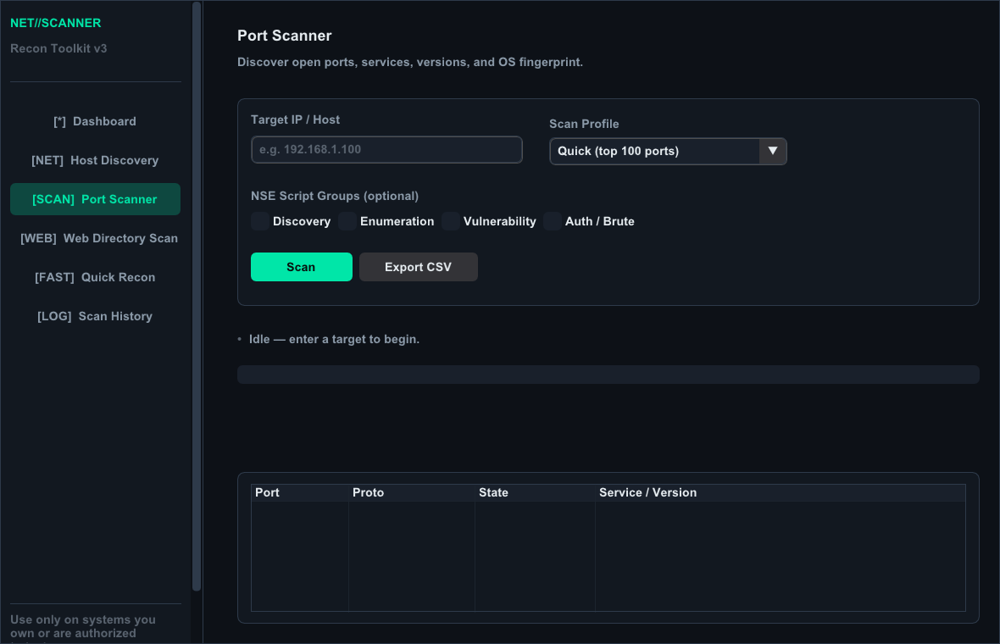
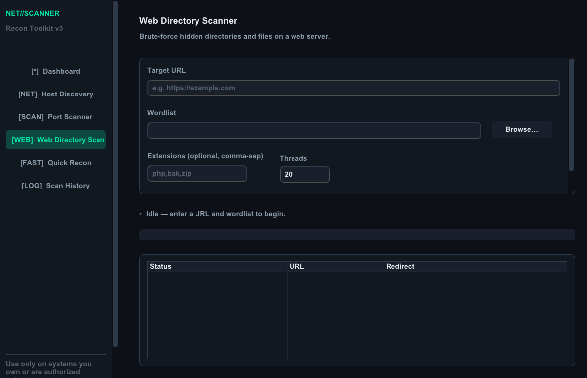
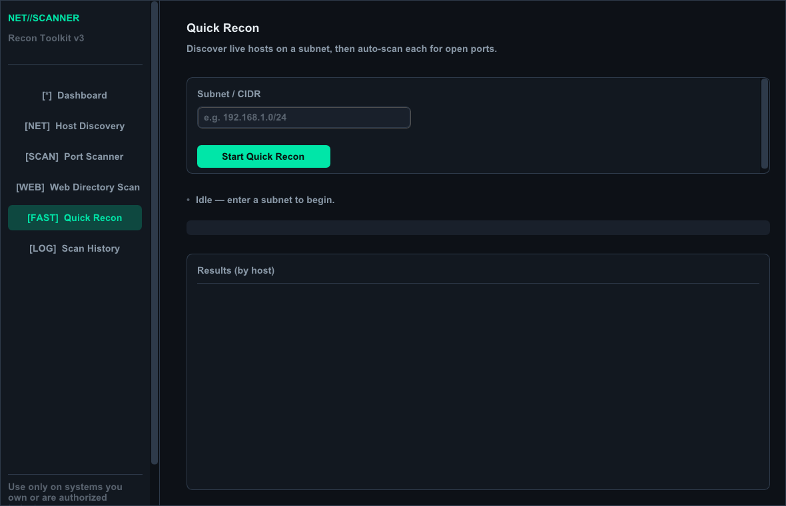
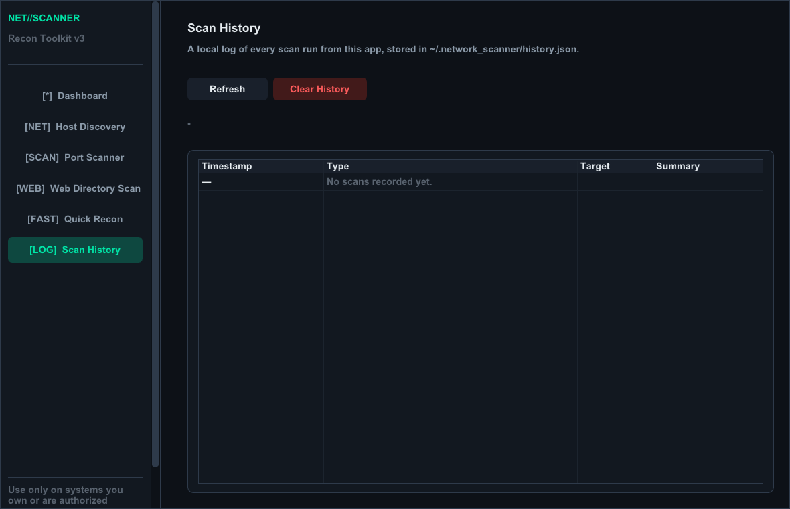

# Network Security Scanner v3

A GUI-based recon toolkit built with Python and DearPyGui, for network
reconnaissance and security assessment on systems you own or are
explicitly authorized to test.



## What's new in v3

This is a full rewrite of the original scanner:

- **Persistent sidebar navigation** instead of screens that get torn down
  and rebuilt on every click
- **Input validation** for IPs, CIDRs, ranges, hostnames, and URLs before
  anything is shelled out to `nmap` or `requests`
- **Live-updating result tables** (color-coded by port state / HTTP
  status) instead of a single scrolling text blob
- **Real cancellation** on every scan type via a Stop button — not just
  the web scanner
- **Concurrent** web directory scanning (thread pool instead of one
  request at a time)
- **NSE script groups** (Discovery / Enumeration / Vulnerability /
  Auth-Brute) selectable on the port scanner
- **Quick Recon** — a guided workflow that ping-sweeps a subnet and then
  automatically port-scans every live host it finds
- **Scan History** — a local, persistent log of past scans
  (`~/.network_scanner/history.json`) so you can pick up where you left
  off across sessions
- **Export** any result set to CSV, JSON, or TXT
  (`~/network_scanner_exports/`)

## Features

### Host Discovery

- Ping-sweeps a subnet/CIDR/range to find live hosts
- Resolves hostnames, MAC addresses, and hardware vendors
- Live progress bar and cancellable mid-scan



### Port Scanner

- Scan profiles: Quick, SYN, Version Detection, OS Detection,
  Comprehensive (`-A`), UDP, all-65535, Vulnerability (NSE `vuln`), etc.
- Optional NSE script groups layered on top of any profile
- OS fingerprint + MAC/vendor panel
- Color-coded open/closed/filtered port table



### Web Directory Scanner

- Concurrent brute-force of directories/files with a custom wordlist
- Optional extension list (`.php,.bak,.zip`) appended to every candidate
- Configurable thread count
- Color-coded results by HTTP status class (2xx/3xx/4xx/5xx)



### Quick Recon

- One click: sweep a subnet, then auto port-scan (top 100 ports) every
  host found, streamed into a per-host tree view



### Scan History

- Every completed scan is logged locally with timestamp, type, target,
  and a one-line summary



## Requirements

- Python 3.9+
- [Nmap](https://nmap.org/download.html) installed and on your `PATH`
  (required for Host Discovery and Port Scanner)
- A wordlist for the Web Directory Scanner — e.g.
  [SecLists](https://github.com/danielmiessler/SecLists)

## Installation

```bash
git clone <this-repo>
cd network-scanner
pip install -r requirements.txt
python main.py
```

## Project layout

```
main.py            entrypoint — builds the window and registers screens
app_shell.py        sidebar nav + content-area shell, dashboard screen
scan_engine.py       UI-agnostic scan logic: validation, nmap wrapper,
                      web dir scanner, NSE helpers, export
scan_history.py      persistent local scan log
themes.py            dark theme, colors, widget styling
ui_widgets.py         shared widgets (cards, buttons, status pills)
hostlookup.py        Host Discovery screen
portscanner.py       Port Scanner screen
webdir.py            Web Directory Scanner screen
quickrecon.py        Quick Recon screen
history_view.py      Scan History screen
code.py              backwards-compatible wrappers + CLI mode
```

## Ethical usage

This tool is for security professionals, network administrators, and
learners to test systems they own or have explicit written authorization
to assess.

⚠️ **Unauthorized scanning of networks or systems may be illegal in your
jurisdiction.** Always get proper authorization before conducting any
security testing.

## Acknowledgments

- [DearPyGui](https://github.com/hoffstadt/DearPyGui) for the GUI framework
- [python-nmap](https://pypi.org/project/python-nmap/) for the nmap wrapper
